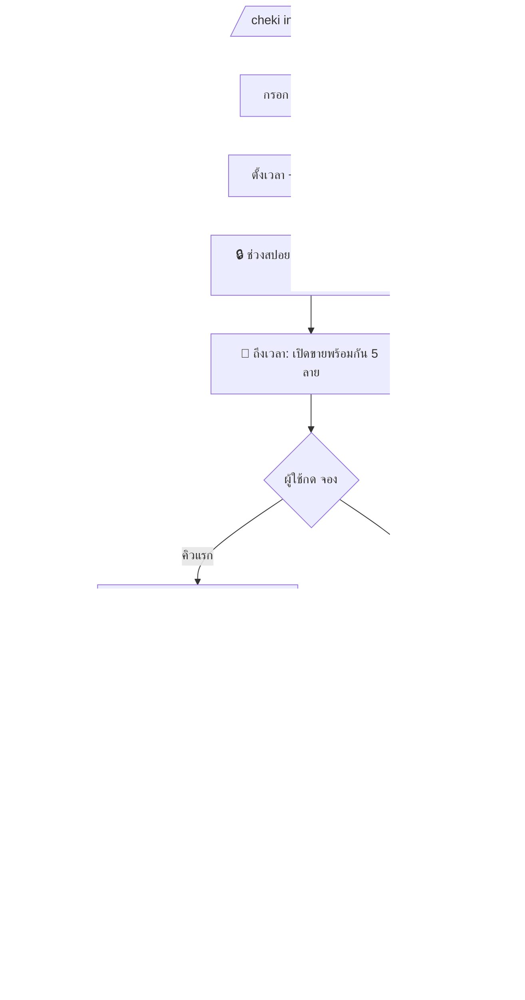

<div align="center">

# 🎟️ rlanz-cheki

**บอท Discord ขายเชกิแบบดรอป — คิวสำรอง · ตรวจสลิปด้วยมือ · QR พร้อมเพย์ · ต้นทุน 0 บาท/เดือน**

A Discord bot for selling limited *cheki* prints via timed drops, a waitlist queue,
manual PromptPay slip verification, and private per-design checkout channels.

[](https://nodejs.org)
[](https://discord.js.org)
[](https://github.com/WiseLibs/better-sqlite3)
[](#-deploy-with-docker-recommended)
[](#)
[](LICENSE)

</div>

---

## 📌 ภาพรวม (Overview)

ขายเชกิ **5 ลาย ลายละ 1 ชิ้น** ในเซิร์ฟเวอร์ Discord ของคุณเอง โดย:

- 🗓️ **ดรอปตามเวลานัด** — มีช่วง *สปอย* (ภาพเบลอ + นับถอยหลัง) ก่อน แล้วเปิดขายทั้ง 5 ลายพร้อมกัน
- 🎫 **คิวสำรอง (waitlist)** — กด "จอง" เข้าคิว, คิวแรกได้สิทธิ์ซื้อ; ถ้าไม่จ่าย แอดมินกดข้ามไปคิวถัดไป
- 🔒 **ห้องชำระเงินส่วนตัว** — เห็นแค่ผู้ซื้อ + แอดมิน สำหรับโอนเงิน / ส่งสลิป / ส่งที่อยู่
- 💳 **QR พร้อมเพย์ฝังยอดอัตโนมัติ** — สแกนแล้วจำนวนเงินขึ้นตรงเป๊ะต่อลาย (ไม่ใช้ payment gateway)
- ✅ **ตรวจสลิปด้วยมือ** — แอดมินกด *ยืนยันการขาย* หรือ *ปล่อยคิว* เอง
- 🟢🟡🔴 **อัปเดตสถานะบน Embed อัตโนมัติ** — ว่าง / กำลังชำระเงิน / ขายแล้ว + จำนวนคิว

> ทำงานบนเครื่องเดียว ต้นทุนหลักเป็น 0 — เหมาะกับการรันบน VPS ที่มีอยู่แล้ว

---

## ✨ Features

| | |
|---|---|
| 🛠️ **แผงควบคุมแอดมิน** | ตั้งค่าทุกลาย (ชื่อ/คำอธิบาย/ราคา/รูป), พรีวิว, ตั้งเวลา, สั่งเปิดขาย — ผ่านปุ่ม + modal |
| ⏱️ **ตั้งเวลา + กู้คืนเอง** | เวลานัดเก็บใน DB; บอทรีสตาร์ทแล้ว re-arm timer เอง ไม่พลาดดรอป |
| 🧮 **คิวกัน race condition** | ใช้ SQLite transaction + per-item mutex — กดจองพร้อมกันได้คิวแรกแค่คนเดียวแน่นอน |
| 🔁 **ใช้ห้องส่วนตัวซ้ำ** | เลื่อนคิวแล้วเปลี่ยนสิทธิ์ + ล้างประวัติให้คนใหม่ (ไม่ชนลิมิตสร้างห้อง) |
| 🧾 **บันทึกออเดอร์** | เก็บผู้ซื้อ + ราคา + ที่อยู่ลงตาราง `won_orders` ก่อนลบห้อง ข้อมูลไม่หาย |
| 🐳 **Docker-ready** | `docker compose up -d` จบ ไม่ต้องลง Node/build tools บน VPS |

---

## 🔄 Flow การขาย



---

## 🧱 Tech Stack

**Node.js (≥18)** · **discord.js v14** · **better-sqlite3** · **promptpay-qr + qrcode** · **Docker / PM2**

---

## 🐳 Deploy with Docker (แนะนำ)

```bash
git clone <your-repo-url> rlanz-cheki && cd rlanz-cheki

cp .env.example .env          # กรอก DISCORD_TOKEN / APP_ID / GUILD_ID

docker compose up -d --build  # build + รัน (restart อัตโนมัติหลังรีบูต)

# ลงทะเบียน /cheki ครั้งเดียว (หรือเมื่อแก้คำสั่ง)
docker compose run --rm bot node src/deploy-commands.js
```

คำสั่งที่ใช้บ่อย:

```bash
docker compose logs -f                 # ดู log
docker compose up -d --build           # อัปเดตหลัง git pull
docker compose down                    # หยุด
```

> ข้อมูลทั้งหมด (DB + รูป + backup) อยู่บน host ที่โฟลเดอร์ `./data` — สำรองง่าย ลบ container ได้ไม่หาย

<details>
<summary>⚙️ ทางเลือก: รันแบบไม่ใช้ Docker (PM2)</summary>

```bash
npm ci                       # ต้องมี build-essential/python3 หากไม่มี prebuilt ของ better-sqlite3
cp .env.example .env         # กรอกค่า
npm run deploy               # ลงทะเบียน /cheki
pm2 start ecosystem.config.cjs
pm2 save && pm2 startup      # รันอัตโนมัติหลังรีบูต
```
</details>

---

## 🔧 ตั้งค่า Discord Developer Portal

1. สร้าง **Application + Bot** → คัดลอก **Token** และ **Application ID**
2. เปิด **Privileged Gateway Intents → Server Members Intent**
3. เชิญบอทด้วย scope `bot applications.commands` พร้อมสิทธิ์:
   **Manage Channels · Manage Roles · Send Messages · Embed Links · Attach Files · Read Message History · Manage Messages**
   > ⚠️ ต้องมี **Manage Roles** เพื่อตั้ง permission overwrite ของห้องส่วนตัว

| Env | จำเป็น | คำอธิบาย |
|-----|:---:|----------|
| `DISCORD_TOKEN` | ✅ | Bot token |
| `APP_ID` | ✅ | Application (client) ID |
| `GUILD_ID` | ✅ | ID เซิร์ฟเวอร์ (คำสั่งแบบ guild-scoped อัปเดตทันที) |
| `DB_PATH` | – | ตำแหน่งไฟล์ SQLite (ดีฟอลต์ `./data/cheki.db`) |
| `TZ` | – | โซนเวลา (ดีฟอลต์ `Asia/Bangkok`) |

---

## 💬 คำสั่ง `/cheki` (แอดมินเท่านั้น)

| Subcommand | หน้าที่ |
|---|---|
| `/cheki config` | ตั้ง admin role / ห้องประกาศ / category ห้องส่วนตัว / เลขพร้อมเพย์ |
| `/cheki init` | สร้างดรอปใหม่ + วางแผงควบคุมในห้องนี้ (ห้องนี้กลายเป็นห้อง Setup) |
| `/cheki image` | อัปโหลด/เปลี่ยนรูปของลาย (`slot` 1–5) |
| `/cheki preview` | พรีวิว 5 ลาย (เห็นเฉพาะคุณ) |
| `/cheki status` | ดูสถานะดรอป + คิวแต่ละลาย |
| `/cheki cancel-drop` | ยกเลิกดรอปปัจจุบัน |

### ขั้นตอนใช้งานโดยแอดมิน
1. `/cheki config admin_role:… announce_channel:… ticket_category:… promptpay_id:…`
2. `/cheki init` → กด **แก้ #1..#5** กรอกข้อมูล → `/cheki image slot:1 file:…` (ครบทั้ง 5)
3. กด **ตั้งเวลาดรอป** (`YYYY-MM-DD HH:mm` เวลาไทย + นาทีสปอย) → **พรีวิว** → **ยืนยันตารางขาย**
4. ถึงเวลา → บอทเปิดขายเอง · มีคนคิวแรก → ห้องส่วนตัว + QR โผล่อัตโนมัติ
5. ตรวจสลิป → **✅ ยืนยันการขาย** (กรอกที่อยู่) หรือ **⏭️ ปล่อยคิว** · จบงานกด **🧹 ลบห้องส่วนตัวทั้งหมด**

> 💡 **เคล็ดลับกันสลิปปลอม:** ตั้งราคาต่างกันเล็กน้อยต่อลาย (เช่น 349 / 359 / 369) เพื่อให้ยอดเงินใน QR บอกได้ว่าใครจ่ายลายไหน

---

## 🗂️ โครงสร้างโปรเจกต์

```
src/
├── index.js              entrypoint: client, events, rehydrate
├── config.js logger.js
├── deploy-commands.js    ลงทะเบียน /cheki (guild-scoped)
├── db/                   db.js · schema.sql · repo.js  ← SQL + transaction ทั้งหมด
├── commands/cheki.js     /cheki config|init|image|preview|status|cancel-drop
├── interactions/         router · ids · guards · setupPanel · buttons/* · modals/*
├── services/             qrService · embedService · ticketService · queueService · dropService
└── lib/                  context · mutex · time
data/                     cheki.db (+wal/shm) · images/<dropId>/<slot> · backups/  (ไม่เข้า git)
```

---

## 💾 ข้อมูล & สำรองข้อมูล

- **ฐานข้อมูล:** `data/cheki.db` (โหมด WAL — มีไฟล์ `-wal`/`-shm` ด้วย)
- **ประวัติการขาย:** `sqlite3 data/cheki.db "SELECT * FROM won_orders;"`
- **สำรองรายคืน (cron บน host):**
  ```bash
  0 3 * * * sqlite3 /path/rlanz-cheki/data/cheki.db ".backup '/path/rlanz-cheki/data/backups/cheki-$(date +\%F).db'"
  ```

---

## 🔒 หมายเหตุความปลอดภัย

- QR พร้อมเพย์จะเปิดเผยเบอร์/เลขบัตรของผู้ขาย (เป็นเรื่องปกติของการรับเงินสาธารณะ)
- ตรวจสลิปเป็นแบบ Manual — แนะนำขอสลิปที่มี QR ตรวจสอบ และเช็กยอด/เวลา/ชื่อผู้โอนให้ตรง
- ที่อยู่ผู้ซื้ออยู่ในห้องส่วนตัวเท่านั้น และถูกบันทึกลง `won_orders` ก่อนลบห้อง
- `.env` ถูกใส่ใน `.gitignore` แล้ว — อย่า commit token

---

## 📝 License

[MIT](LICENSE) © 2026 rlanz
